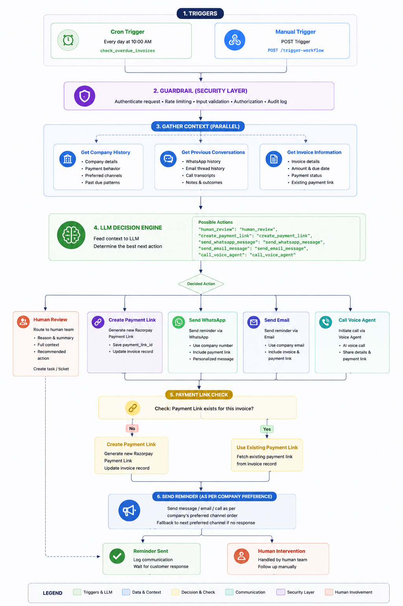

# 💳 Razorpay Autonomous AI Receivables Recovery Agent

### AI-powered omnichannel B2B invoice recovery, intelligent follow-ups, and payment reconciliation

[](https://razorpay.com)
[](https://fastapi.tiangolo.com)
[](https://nextjs.org)
[](https://ai.google.dev)
[](https://business.whatsapp.com)
[](https://elevenlabs.io)
[](https://www.postgresql.org)

> **Creating an invoice is easy. Getting the payment on time is the
> difficult part.**

The **Razorpay Autonomous AI Receivables Recovery Agent** automates the
last mile of the B2B payment lifecycle: detecting overdue invoices,
gathering customer context, deciding the next best recovery action,
communicating through WhatsApp/email/voice, generating Razorpay payment
links when required, and reconciling successful payments.

------------------------------------------------------------------------

## 📌 Problem

Businesses often manage overdue receivables manually:

-   identify overdue invoices
-   check previous customer conversations
-   decide whether to send WhatsApp, email, or call
-   generate or find a payment link
-   follow up on customer promises
-   handle disputes
-   verify successful payments
-   maintain recovery history

This becomes difficult as invoice volume grows.

The goal is therefore not to **send more reminders**, but to make every
recovery action **context-aware and controlled**.

------------------------------------------------------------------------

## 💡 Solution

The agent combines:

-   **Razorpay Payment Links** for payment collection
-   **Google Gemini** for contextual action selection
-   **LangGraph/LangChain** for workflow orchestration
-   **Meta WhatsApp Cloud API** for messaging
-   **Gmail API** for email
-   **ElevenLabs --- JEA** for voice recovery
-   **PostgreSQL + Prisma** for persistent state and audit history

The architecture follows an important principle:

> **The LLM decides the next action; deterministic backend services
> verify and execute it.**

Financial state, payment confirmation, security checks, retry limits,
and critical business rules remain under backend control.

------------------------------------------------------------------------

# 🏗️ System Architecture

## End-to-End Recovery Flow


### High-level flow

``` text
                 ┌──────────────────────┐ 
                 │     TRIGGER LAYER    │
                 │                      │
                 │ Cron                 │
                 │ check_overdue_       │
                 │ invoices             │
                 │        OR            │
                 │ Manual POST Trigger  │
                 └──────────┬───────────┘
                            ↓
                 ┌──────────────────────┐
                 │ SECURITY /           │
                 │ GUARDRAIL LAYER      │
                 │                      │
                 │ Auth • Validation    │
                 │ Eligibility • Limits │
                 │ Audit • Deduplication│
                 └──────────┬───────────┘
                            ↓
              ┌───────────────────────────────┐
              │     PARALLEL CONTEXT FETCH    │
              ├──────────────┬────────────────┤
              │              │                │
              ↓              ↓                ↓
       Company History   Conversations   Invoice Info
              │              │                │
              └──────────────┴────────────────┘
                            ↓
                 ┌──────────────────────┐
                 │   GEMINI LLM         │
                 │ Decision Engine      │
                 └──────────┬───────────┘
                            ↓
                    ┌──────────────┐
                    │ Next Action  │
                    └──────┬───────┘
                           │
       ┌───────────┬───────┼──────────┬─────────────┐
       ↓           ↓       ↓          ↓             ↓
  human_review  create_  WhatsApp    Email      Voice Agent
                payment_   message   message       JEA
                  link
                              │
                              ↓
                  ┌────────────────────┐
                  │ Payment Link Check │
                  └─────────┬──────────┘
                            ↓
                    Link already exists?
                       ↙            ↘
                     YES             NO
                      ↓               ↓
                Reuse Link      Create Razorpay
                                  Payment Link
                       ↘            ↙
                         ↓
                Send According to
                Company Preference
                         ↓
                   Log Recovery
                         ↓
                    Wait / Continue
```

------------------------------------------------------------------------

# ⚙️ Detailed Workflow

## 1. Trigger Layer

The recovery workflow starts from either an automated or manual trigger.

### Automated Cron

``` text
check_overdue_invoices
```

The scheduler identifies invoices that are eligible for recovery.

### Manual Trigger

For testing, demonstrations, or operational use, the workflow can also
be started manually:

``` http
POST /trigger-workflow
```

This allows the complete workflow to be tested immediately without
waiting for the scheduler.

------------------------------------------------------------------------

## 2. Guardrail / Security Layer

Every workflow request passes through a guardrail layer before the AI
performs any action.

Typical checks include:

-   authentication and authorization
-   request validation
-   invoice eligibility
-   current payment status
-   recovery attempt limits
-   duplicate workflow prevention
-   customer/invoice existence
-   audit logging

This layer prevents an LLM decision from directly bypassing business
rules.

------------------------------------------------------------------------

## 3. Parallel Context Gathering

Once the request passes the guardrails, the agent retrieves three
context groups **in parallel**.

### 🏢 Company History

Retrieves:

-   company/customer details
-   preferred communication channel
-   previous payment behavior
-   previous recovery attempts
-   historical outcomes

### 💬 Previous Invoice Conversations

Retrieves:

-   WhatsApp history
-   email threads
-   voice-call outcomes/transcripts
-   previous promises to pay
-   objections and disputes

### 🧾 Invoice Information

Retrieves:

-   invoice number
-   amount
-   due date
-   overdue status
-   payment status
-   existing Razorpay payment link

All three are combined into a structured context for Gemini.

------------------------------------------------------------------------

## 4. Gemini Decision Engine

Gemini receives the contextual information and determines the most
appropriate next action.

Possible actions:

``` json
{
  "human_review": "human_review",
  "create_payment_link": "create_payment_link",
  "send_whatsapp_message": "send_whatsapp_message",
  "send_email_message": "send_email_message",
  "call_voice_agent": "call_voice_agent"
}
```

The model can consider:

-   overdue duration
-   company preference
-   previous communication
-   previous recovery attempts
-   customer behavior
-   existing payment link
-   whether escalation is appropriate

The model produces an **action**, not unrestricted execution.

------------------------------------------------------------------------

# 🌳 Action Routing

## 👤 `human_review`

If Gemini determines that automation should stop:

``` text
Gemini
  ↓
human_review
  ↓
Human Intervention
```

The human reviewer receives relevant context such as:

-   customer
-   invoice
-   conversation history
-   reason for escalation
-   previous recovery attempts
-   AI recommendation

Examples include disputes, invoice mismatches, or situations requiring
manual handling.

------------------------------------------------------------------------

## 💳 `create_payment_link`

If the selected action is:

``` text
create_payment_link
```

the backend creates a Razorpay Payment Link and stores it against the
invoice.

``` text
Invoice
   ↓
Razorpay Payment Links API
   ↓
Payment Link
   ↓
Persist Payment Link
```

------------------------------------------------------------------------

## 📱 `send_whatsapp_message`

If Gemini selects WhatsApp:

``` text
send_whatsapp_message
        ↓
Check Payment Link
        ↓
Existing? ── YES ──→ Reuse
        │
        NO
        ↓
Create Razorpay Link
        ↓
Send WhatsApp Reminder
```

The message can include the invoice context and Razorpay payment link.

------------------------------------------------------------------------

## 📧 `send_email_message`

The same payment-link validation applies to email:

``` text
send_email_message
        ↓
Check Payment Link
        ↓
Existing? ── YES ──→ Reuse
        │
        NO
        ↓
Create Razorpay Link
        ↓
Send Email Reminder
```

------------------------------------------------------------------------

## 📞 `call_voice_agent`

For voice recovery:

``` text
call_voice_agent
        ↓
Check Payment Link
        ↓
Existing? ── YES ──→ Reuse
        │
        NO
        ↓
Create Razorpay Link
        ↓
Call ElevenLabs Agent — JEA
```

JEA can receive the relevant invoice/customer context for the
conversation.

------------------------------------------------------------------------

# 🎯 Company Communication Preference

For communication actions, the system respects the configured
company/customer preference.

Example:

``` text
Company Preference
        ↓
   WhatsApp
        ↓
send_whatsapp_message
```

or:

``` text
Company Preference
        ↓
   Email
        ↓
send_email_message
```

or:

``` text
Company Preference
        ↓
   Voice
        ↓
call_voice_agent
```

This allows the same recovery engine to support different communication
strategies without changing the core workflow.

------------------------------------------------------------------------

# 💰 Razorpay Payment Lifecycle

Razorpay is integrated into the actual payment lifecycle.

``` text
Overdue Invoice
      ↓
AI Recovery Decision
      ↓
Payment Link Check
      ↓
Create / Reuse Razorpay Link
      ↓
Customer Receives Reminder
      ↓
Customer Opens Payment Link
      ↓
Payment Completed
      ↓
Razorpay Webhook
      ↓
Signature Verification
      ↓
Invoice → PAID
```

------------------------------------------------------------------------

# 🔐 Razorpay Webhook Reconciliation

The payment webhook is handled independently from the recovery decision
workflow.

``` text
POST /api/recovery/webhooks/razorpay
                  ↓
        Verify X-Razorpay-Signature
                  ↓
             Signature valid?
              ↙            ↘
            NO              YES
            ↓                ↓
       Reject 400       Process Event
                              ↓
                    payment_link.paid
                              OR
                     payment.captured
                              ↓
                     Update Invoice
                              ↓
                       Status = PAID
                              ↓
                    Store Payment ID
                              ↓
                    Store Timestamp
                              ↓
                  Send Confirmation
```

This makes payment state dependent on verified Razorpay events rather
than an LLM assumption.

------------------------------------------------------------------------

# 🔄 Recovery State

Every important workflow event can be persisted for visibility and
auditing.

Example:

``` text
Workflow Started
      ↓
Guardrail Passed
      ↓
Context Retrieved
      ↓
AI Decision
      ↓
Payment Link Created / Reused
      ↓
Communication Sent
      ↓
Customer Response
      ↓
Follow-up / Escalation
      ↓
Payment Confirmed
      ↓
Invoice PAID
```

------------------------------------------------------------------------

# 🧩 Technology Stack

  Layer        Technology
  ------------ ----------------------------------------
  Frontend     Next.js
  Backend      FastAPI
  Workflow     LangGraph / LangChain
  LLM          Google Gemini
  Database     PostgreSQL
  ORM          Prisma
  Payment      Razorpay APIs
  Messaging    Meta WhatsApp Cloud API
  Email        Gmail API
  Voice AI     ElevenLabs --- JEA
  Scheduling   Cron / APScheduler
  Retrieval    PostgreSQL / pgvector where applicable

------------------------------------------------------------------------

# 📁 Project Structure

``` text
razorpay-recovery-agent/
│
├── recovery-agent-server/
│   ├── src/
│   │   └── recovery_agent_server/
│   │       ├── api/
│   │       ├── services/
│   │       ├── workflows/
│   │       ├── models/
│   │       └── main.py
│   ├── prisma/
│   ├── requirements.txt
│   └── .env.example
│
├── recovery-agent-client/
│   ├── app/
│   ├── components/
│   ├── lib/
│   └── .env.example
│
├── docs/
│   └── recovery-agent-flow.png
│
└── README.md
```

------------------------------------------------------------------------

# 🚀 Quick Start

## Prerequisites

-   Python 3.11+
-   Node.js 18+
-   PostgreSQL
-   Razorpay Test Account
-   Google Gemini API key
-   Meta WhatsApp Cloud API credentials
-   Gmail OAuth credentials
-   ElevenLabs credentials

## Backend

``` bash
cd recovery-agent-server

cp .env.example .env

pip install -r requirements.txt

prisma db push
prisma generate

uvicorn src.recovery_agent_server.main:app --host 0.0.0.0 --port 8000 --reload
```

Swagger:

``` text
http://127.0.0.1:8000/docs
```

## Frontend

``` bash
cd recovery-agent-client

cp .env.example .env.local

npm install
npm run dev
```

Dashboard:

``` text
http://localhost:3000
```

------------------------------------------------------------------------

# 🔌 Webhooks

### Razorpay

``` text
POST /api/recovery/webhooks/razorpay
```

### WhatsApp

``` text
POST /api/recovery/webhooks/whatsapp
```

### ElevenLabs

``` text
POST /api/recovery/webhooks/elevenlabs
```

Webhook endpoints should be publicly reachable when integrated with
external providers.

------------------------------------------------------------------------

# 🎬 Evaluator Demo Flow

A concise demonstration can follow this sequence:

1.  Open the recovery dashboard.
2.  Select an overdue invoice.
3.  Trigger Recovery manually.
4.  Show the guardrail layer.
5.  Show parallel retrieval of company history, conversation history,
    and invoice information.
6.  Show Gemini selecting the next action.
7.  Demonstrate payment-link reuse or creation.
8.  Send the reminder through WhatsApp, email, or JEA voice.
9.  Open the Razorpay Test Mode payment link.
10. Complete the simulated payment.
11. Show the Razorpay webhook being verified.
12. Show the invoice changing to `PAID`.
13. Show the payment confirmation sent to the customer.

------------------------------------------------------------------------

# 🧪 Example

Suppose:

``` text
Invoice: INV-1024
Amount: ₹50,000
Status: 8 days overdue
Preferred Channel: WhatsApp
Previous Contact: No response
Payment Link: Missing
```

The agent executes:

``` text
Trigger
  ↓
Guardrail
  ↓
┌──────────────────┬─────────────────────┬──────────────────┐
│ Company History  │ Conversation History│ Invoice Details  │
└──────────────────┴─────────────────────┴──────────────────┘
                     ↓
                  Gemini
                     ↓
          send_whatsapp_message
                     ↓
            Payment Link Exists?
                 ↙        ↘
               NO          YES
               ↓            ↓
         Create Link     Reuse Link
               ↘            ↙
                  ↓
             Send WhatsApp
                  ↓
             Log Attempt
```

------------------------------------------------------------------------

# ⭐ Why This Architecture Matters

A traditional reminder system might look like:

``` text
Invoice overdue
      ↓
Send reminder
      ↓
Wait
      ↓
Send another reminder
```

This system instead performs:

``` text
Invoice overdue
      ↓
Understand customer context
      ↓
Retrieve previous conversations
      ↓
Retrieve invoice state
      ↓
Reason about next best action
      ↓
Apply guardrails
      ↓
Create / reuse payment link
      ↓
Communicate through the appropriate channel
      ↓
Track recovery state
      ↓
Reconcile payment through Razorpay
```

The result is a recovery workflow that is **context-aware, event-driven,
auditable, and integrated directly with the payment lifecycle**.

------------------------------------------------------------------------

# 🔮 Future Improvements

-   adaptive recovery strategies based on historical outcomes
-   multilingual voice recovery
-   advanced promise-to-pay tracking
-   configurable escalation policies
-   recovery analytics and conversion dashboards
-   richer vector-based conversation retrieval
-   payment-plan workflows
-   organization-level recovery policies
-   human-in-the-loop approval workflows

------------------------------------------------------------------------

# 👨‍💻 Author

**Nishchal Sundan**\
Full Stack & AI Developer\
NIT Jalandhar --- Electronics & Communication Engineering

Built for **Razorpay Buildathon 2026**.

------------------------------------------------------------------------

### 💳 Recover smarter. Communicate better. Get paid faster.

**An AI agent for the last mile of the payment lifecycle.**

